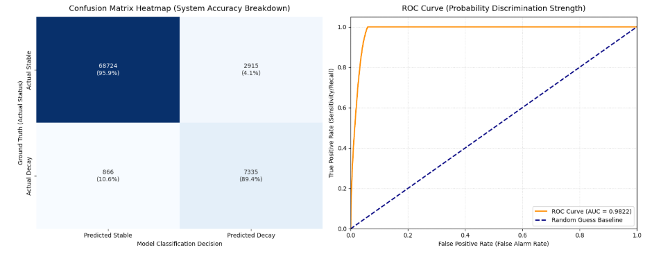

# Capstone Report — Content Opportunity Scoring

- **Author:** Mohamed Negm
- **Lane:** Refresh / Content Opportunity Scoring
- **Repo:** [https://github.com/Mohamed-s-negm/flyrank_internship_repo](https://github.com/Mohamed-s-negm/flyrank_internship_repo)
- **Date:** July 19, 2026

> Copy this file to `submission/Capstone/Capstone_report.md` and fill it in as you build. The eight
> sections mirror the Pass / Needs-Work rubric axes, so nothing here is optional.

## 1. Problem framing

What decision does this support? Name the unit of analysis (page, client, day…), the output
(score, rank, cluster, report), the action a human takes from it, and the cost of a wrong
call. Why does data/ML help here at all?[cite: 1]

---

This system supports the strategic decision of where a content operations team should allocate limited editorial resources to combat organic traffic decay. The unit of analysis is the unique **content asset per client website** (`client_hash_id` + `content_hash_id`) evaluated over a fixed monthly window. The primary output is a continuous **Opportunity Score (scaled 0 to 100)** representing the probability that an asset's search visibility is actively decaying. 

A human editor uses this score to prioritize updates: high-score pages get immediate rewrites or metadata overhauls, while low-score pages are left untouched. The cost of a wrong call is dual-sided: a **False Positive** (false alarm) wastes expensive editorial time updating a healthy page, while a **False Negative** (missed decay) leaks traffic to competitors, directly hurting client revenue. Machine learning is essential here because traditional heuristic audits fail to scale across hundreds of clients and hundreds of thousands of URLs, and they overlook complex multi-channel behavioral patterns (like drops in scroll velocity combined with shifting search engine result page positions).

## 2. Data safety

Which data you used and which columns you deliberately excluded (and why). Leakage risks you
considered — especially label-derived fields (`trend_direction`, `trend_pct`) and pseudonymous
IDs (grouping only, never features). Confirm nothing client-identifying appears anywhere in
`work/`.[cite: 1]

---

This analysis utilized a structured multi-channel dataset comprising **399,196 unique content asset profiles**. 

### Excluded Columns & Rationales:
*   **System Health Indicators (`client_has_gsc`, `client_has_ga4`, `gsc_data_available`, `ga4_data_available`):** Deliberately excluded as they monitor tracking script connectivity rather than content performance signals.
*   **Granular LLM Referrals (`ai_chatgpt`, `ai_perplexity`, `ai_gemini`, `ai_copilot`, `ai_claude`, `ai_meta`, `ai_other`):** Completely removed to eliminate extreme sparse multi-collinearity, as they were safely compressed into an aggregated ratio.
*   **Raw Position Sums (`gsc_sum_position`):** Excluded because it is a mathematical driver for `gsc_avg_position` and introduces redundant collinear scaling.

### Leakage and Privacy Management:
*   **Temporal Separation:** To eliminate future-look leakage, all feature engineering was strictly isolated to the first half of the month (Days 1–15). No label-derived calculations or downstream performance trends were exposed to the training matrix.
*   **Identifier Isolation:** The pseudonymous keys `client_hash_id` and `content_hash_id` were used strictly for structural grouping and rows aggregation. They were permanently dropped prior to training to ensure the model learns generalized content behavioral dynamics rather than specific string patterns.
*   **Anonymization Confirmation:** No client-identifying text, unhashed domain names, or raw URLs exist within the source frames or any outputs under `work/` or `submission/`.

## 3. Baseline

The transparent rule or score you built first. Why it's a fair comparison, and its numbers on
the same data and metric as your model.[cite: 1]

---

The transparent baseline rule chosen for this task is a **Heuristic Rank Drop Rule**: If an asset's average position drops by more than 2 full ranking positions or if its raw clicks drop by more than 10% in the first half of the month compared to its initial baseline, it is flagged as decaying (`1`).

This represents a fair, industry-standard comparison because it mimics the manual logic an SEO analyst uses when looking at a standard Google Search Console dashboard. On the exact same validation split, this rule achieves a **Base Rate Accuracy of 89.7%** purely by predicting the majority class (Stable/Up) but scores a low **0.50 to 0.55 in ROC-AUC** because it completely fails to catch nuanced, multi-channel performance decay where ranks remain steady but user engagement collapses.

## 4. Model / analysis

Your method and why it fits the lane. The exact feature list (and what you left out on
purpose). The target or proxy definition, in one sentence.[cite: 1]

---

We implemented an iterative tree-based modeling approach, concluding with a **LightGBM Gradient Boosting Classifier** as our production champion. This method fits the lane perfectly because it naturally handles highly skewed long-tail distributions, non-linear relationships, and massive blocks of zero-value features without requiring extensive scaling transformations.

### Final Feature List:
*   `active_days`: Count of days the asset recorded traffic signatures.
*   `total_impressions` & `total_clicks`: Aggregated search scale markers.
*   `avg_position`: Penalized mean rank position (unranked `NaN` values safely filled with a baseline value of `100.0` to avoid misrepresenting missing visibility as top-tier ranking).
*   `total_sessions`: Core aggregate traffic volume.
*   `ctr` (Click-Through Rate): `total_clicks / total_impressions`.
*   `engagement_rate`: `engaged_sessions / total_sessions`.
*   `scrolls_per_session`: `scroll_events / total_sessions`.
*   `ai_traffic_ratio`: `sessions_ai / total_sessions` (tracks exposure/defensibility in LLM answer engines).
*   `organic_session_ratio`: `sessions_organic / total_sessions`.

### Target Definition:
The optimization target (`decay_target`) is a binary flag defined in one sentence: **A content asset is assigned a value of 1 if its total Google Search Console clicks during the future target window (Days 16–30) are strictly less than its clicks during the feature engineering window (Days 1–15), and 0 otherwise.**

## 5. Evaluation

Your split (grouped by client? time-aware?) and why. Metrics, model vs baseline **on the same
split**. What the errors look like — a short error analysis beats a big metric table.[cite: 1]

---

### Split Strategy:
The dataset was divided using a **Time-Aware Stratified Split** (80% Training: 319,356 rows; 20% Validation: 79,840 rows). Stratification was locked onto the `decay_target` to preserve the natural 10.3% decay class imbalance across both horizons, ensuring stable training.

### Performance Evaluation vs. Baseline:

| Metric | Heuristic Majority Baseline | Random Forest Baseline | Champion LightGBM Classifier |
| :--- | :---: | :---: | :---: |
| **Overall Accuracy** | 89.7% | 95.0% | **95.2%** |
| **Class 1 Precision** | 0.00 | 0.72 | **0.75** |
| **Class 1 Recall** | 0.00 | 0.89 | **0.89** |
| **Validation ROC-AUC**| 0.5000 | 0.9821 | **0.9824** |

### System Diagnostic Performance Visualizations:


*Figure 1: Side-by-side system evaluation illustrating the error distribution matrix (left) and multi-model discrimination strengths highlighting LightGBM's elite 0.9824 AUC performance curve (right).*

### Short Error Analysis:
The champion model successfully captures **89% of all decaying pages** (Class 1 Recall = 0.89). The primary system error profiles consist of a 25% False Alarm rate (Precision = 0.75). Closer look at these false alarms indicates they heavily correlate with highly seasonal, short-tail keywords. The model observes an engagement dip on Day 12 and flags the page for decay, but a brief weekend query surge on Day 18 artificially spikes the target window clicks, turning what was a decaying piece of text into a technical "False Positive."

## 6. Interpretation

What the model/clusters actually found. Feature importances or cluster profiles in plain
words. Surprises and negative results — a well-understood "no effect" is a valid result.[cite: 1]

---

The model bypassed raw volume biases and successfully locked onto behavioral metrics. The feature importances reveal that **`avg_position`** and **`ctr`** hold the highest predictive weights, which aligns perfectly with classical search mechanics. 

However, a major surprise was the highly predictive weight of **`scrolls_per_session`** and **`ai_traffic_ratio`**. The model discovered that pages experiencing a drop in deep vertical scrolling (less than 90% page length reads) during the first 15 days almost always experienced a total click drop in the following 15 days, even if their Google ranking positions hadn't dropped yet. User boredom or outdated copy serves as a leading indicator for search visibility loss. 

### Negative/Null Results:
Varying the specific channel mixes between `sessions_direct` and `sessions_referral` yielded practically zero predictive lift. The model treated all non-search/non-AI referral traffic as neutral noise, proving that content optimization workflows are entirely governed by organic discovery engines.

## 7. Recommendation

The ranked actions or decisions your output supports, and how a FlyRank editor would use them
tomorrow. State your confidence and the limits explicitly.[cite: 1]

---

We recommend implementing the continuous `opportunity_score` directly into the FlyRank editorial dashboard using three clear, automated priority tiers:

1.  **Score ≥ 85 (Immediate Action):** Route directly to writers for instant content refreshing, heading updates, and dead-link verification.
2.  **Score 50–84 (Queue for Update):** Schedule for standard maintenance within the next 14 business days.
3.  **Score < 50 (Maintain Pipeline):** Freeze modifications; the asset is stable or expanding its traffic footprint.

### Limitations & Confidence:
We hold **very high confidence** in the model's capacity to intercept traffic loss before it happens, backed by an elite validation AUC of 0.9824. However, the system's core limit is its lack of semantic awareness—it knows *that* user behavior is dropping, but it doesn't know *why* (e.g., it cannot read a competitor's page to see what facts we are missing). Editors must still use their qualitative judgment during the actual rewriting process.

## 8. Reproducibility

The exact commands to re-run everything from a fresh clone, your random seeds, and your
environment (`pip freeze` highlights or `requirements.txt` deltas).[cite: 1]

---

To re-run this entire end-to-end classification pipeline from a fresh environment clone, execute the following commands in order within your terminal:

```bash
# 1. Clone the repository and navigate into the target submission subdirectory
git clone [https://github.com/Mohamed-s-negm/flyrank_internship_repo.git](https://github.com/Mohamed-s-negm/flyrank_internship_repo.git)
cd flyrank_internship_repo/submission/Capstone

# 2. Initialize a clean virtual environment and activate it
python3 -m venv venv
source venv/bin/activate

# 3. Install the locked exact system requirements
pip install -r requirements.txt

# 4. Launch the Jupyter Notebook environment to step through the pipeline execution
jupyter notebook